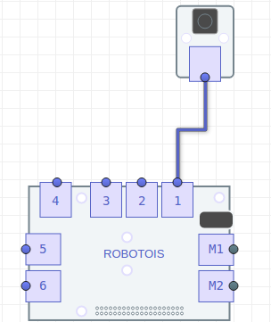

# Conexión al Shield

Es importante considerar que el módulo de botón solo se puede conectar en los puertos `1-6`, ya que los puertos `M1-M2` están designados a módulos de motores. Por ello, para su correcto funcionamiento, se debe especificar el puerto al cuál éste está conectado.

## Ejemplo de conexión del Botón
En la siguiente imágen se observa que el botón se encuentra conectado en el puerto `1` del Shield.



## Inicialización
Con el ejemplo anterior, la inicialización del módulo se realiza de la siguiente manera:

```javascript
const myButton = require('robotois-button');
const button = new myButton(1);
```
