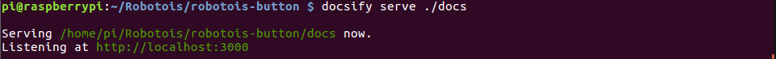

# robotois-button

En este directorio se encuentra la documentación de la librería del módulo del botón. Para visualizar esta documentación se deben seguir los siguientes pasos:

1. Instalar globalmente `docsify-cli`, ya que este paquete ayudará a visualizar el contenido de la documentación de manera local.
```bash
npm install docsify-cli -g
```
2. En la ruta principal de este repositorio ejecutar `docsify serve docs`, tal como se muestra en la siguiente imágen:



3. En el navegador escriba la siguiente ruta: [`http://localhost:3000`](http://localhost:3000). En caso de que este ejecutando desde la Raspberry PI, entonces la ruta debe tener la dirección IP de ésta: `http://192.168.x.x:3000`
