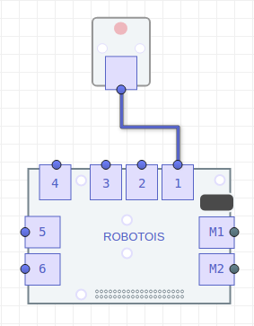

# Primeros Pasos con el Módulo LED

El módulo LED sirve como indicador de algún evento en nuestra aplicación. Este módulo contiene los elementos necesarios para encender un LED, esto es, la interfaz adecuada usando un transistor *NPN*. De esta manera se evitan daños en la Raspberry PI y así se garantiza que el LED se encienda de manera segura.

En este módulo, como es de esperarse, utiliza salidas digitales para su funcionamiento, por ello es importante especificar el puerto al cual éste se conecta.


## Instalación de la librería

La instalación de esta librería se puede realizar de dos maneras:

1. Instalar usando el gestor de paquetes **npm**:
```bash
npm install robotois-led
```
2. Instalar la última versión disponible en [GitHub](https://github.com/Robotois/robotois-led):
```bash
git clone https://github.com/Robotois/robotois-led.git
```
Cuando se descarga del repositorio de **GitHub** es necesario instalar las dependencias, lo cual se realiza ejecutando en el directorio (`cd robotois-led`): `npm install`.

## Inicialización


Para el Módulo LED es necesario especificar en que puerto se va a conectar, en este caso se puede utilizar los puertos de propósito general `1-6` ya que los puertos `M1-M2` son designados para motores. La inicialización se realiza de la siguiente manera:

```javascript
const LED = require('robotois-led');

const led = new LED(1);
```

## Establecer el estado del LED
El estado del LED se puede cambiar de dos maneras:

* La primera consiste en proporcionar de manera explícita el estado deseado (*encendido/apagado*):

```javascript
led.write(1);
setTimeout(() => {
  led.write(0);
}, 2000);
```
* La segunda es utilizar las funciones `turnOn()` y `turnOff()`:

```javascript
led.turnOn();
setTimeout(() => {
  led.turnOff();
}, 2000);
```
